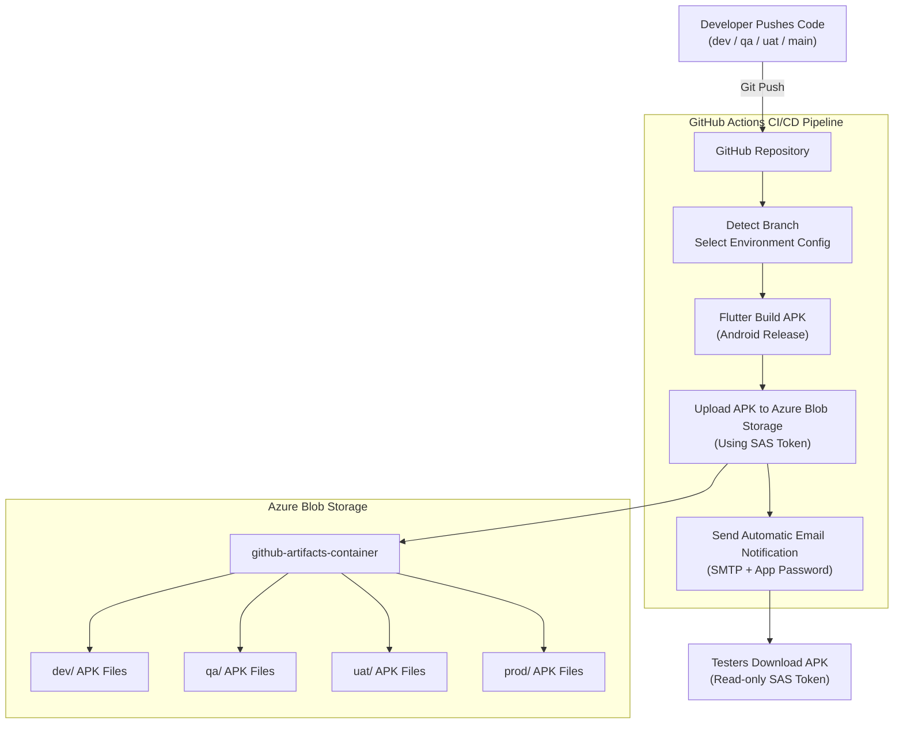

# Flutter Multi-Platform App with Azure CI/CD

## Overview
This project is a demo **Flutter application** created to explore:

- Multi-platform Flutter development  
- Multi-environment builds (DEV / QA / UAT / PROD)  
- CI/CD automation using **GitHub Actions**  
- Uploading Android APKs to **Azure Blob Storage**  
- Email notifications using **SMTP**  
- Environment-based UI changes  
- Secure storage of secrets in GitHub  

The same Flutter codebase builds different environment apps with different colors, titles, and configurations.

---

## Features

- Multi-platform Flutter app  
- Environment-specific configuration system  
- Separate DEV and QA workflows  
- Automatic APK build on branch push  
- Automatic upload to Azure Blob Storage  
- Read-only + upload SAS token integration  
- SMTP email notifications  
- Secure GitHub secrets handling  
- Scalable for team-based deployments  

---

## Tech Stack

- **Flutter**  
- **GitHub Actions**  
- **Azure Blob Storage**  
- **SMTP / Gmail App Password**  
- **Bash** & **cURL**  

---

## CI/CD Workflow Summary

Each branch triggers a different pipeline:

| Branch | Workflow File | Environment | Color | Notifies |
|--------|----------------|-------------|--------|----------|
| `dev` | dev-android.yml | DEV | Red | Developer |
| `qa` | qa-android.yml | QA | Orange | QA team |

Pipeline Steps:
1. Detect environment  
2. Copy correct environment config  
3. Install Flutter  
4. Build APK  
5. Generate versioned APK filename  
6. Upload to Azure Blob Storage  
7. Send email with download link

